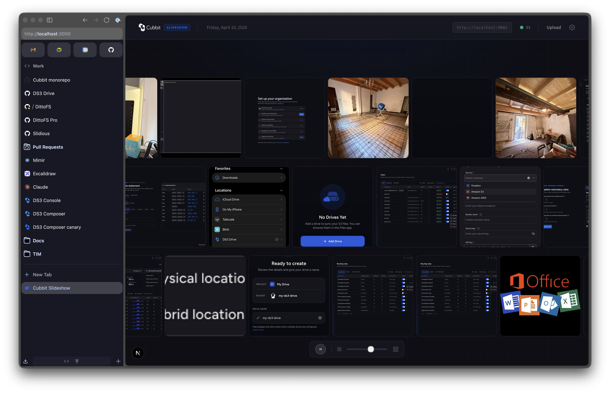
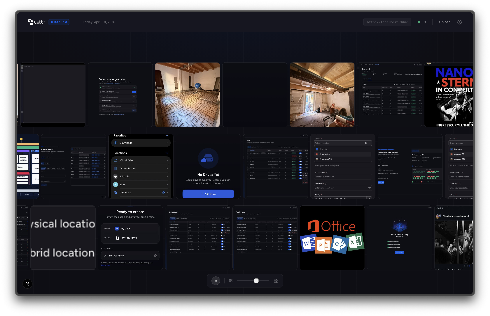
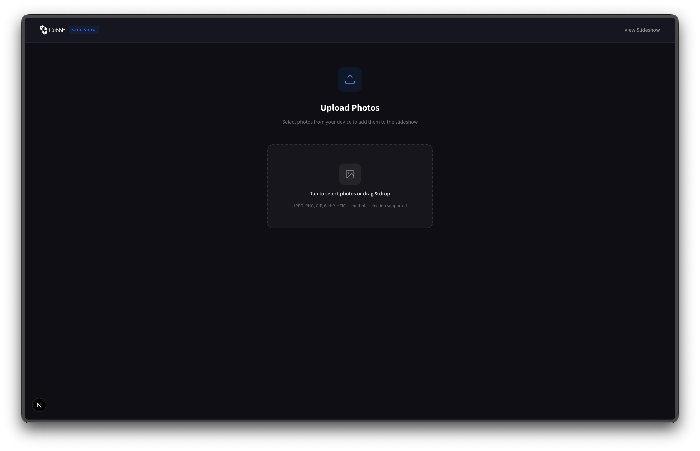
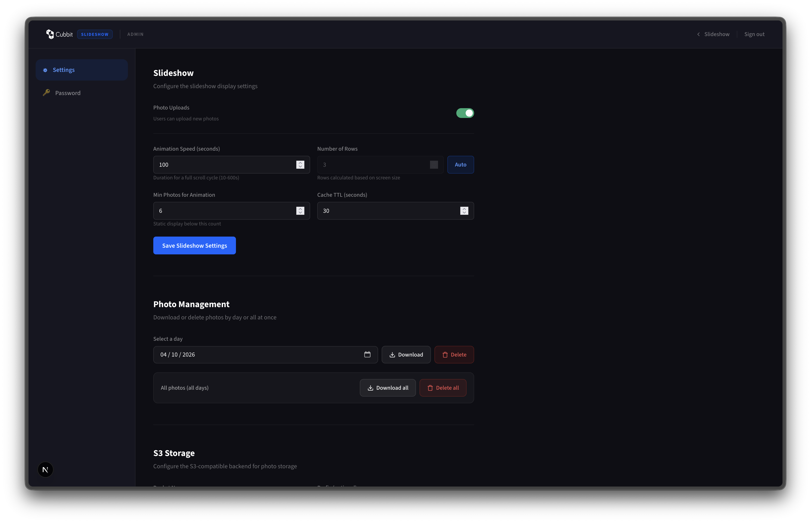

# Cubbit Slideshow

A modern photo slideshow app powered by S3-compatible storage. Upload photos from any device, display them in a beautiful infinite-scrolling carousel on big screens, TVs, or digital signage. Built for events, lobbies, and shared experiences.

## Screenshots

| Slideshow                                    | Slideshow (full)                                       |
| -------------------------------------------- | ------------------------------------------------------ |
|  |  |

| Upload                                 | Admin Panel                          |
| -------------------------------------- | ------------------------------------ |
|  |  |

## Features

- **Infinite carousel**: Dynamic row count based on screen size, alternating scroll directions, GPU-accelerated animations
- **Photo size slider**: Finder-style slider to control photo density — smaller cards show more photos, larger cards show more detail
- **Real-time updates**: SSE-driven photo sync with safety polling — new photos appear within seconds with 3D drop-in animation and "NEW" badge
- **Trackpad scrolling**: Swipe horizontally on any row to scroll it, mouse wheel support
- **Date browsing**: Date picker in the header to browse photos from previous days
- **Mobile-first upload**: Multi-photo selection with drag-and-drop, per-file progress tracking, scrollable queue
- **Upload control**: Admin toggle to enable/disable uploads — reflected in real-time on the upload page
- **Photo management**: Download or delete photos by day or all at once (zip download), individual photo download/delete from zoom modal
- **Admin panel**: Configure S3 backend, slideshow settings (speed, rows, auto-rows), upload toggle, and password — all persisted in SQLite
- **S3 health monitoring**: Live connectivity indicator — upload and slideshow disabled when S3 is unreachable
- **Auto-generated thumbnails**: 480x480 JPEG thumbnails with EXIF rotation fix for fast carousel loading
- **Dynamic rows**: Auto-calculate optimal row count from screen height, or set a fixed value
- **Micro-animations**: Header slide-in, carousel fade-in, modal scale, empty state float, pause button pulse
- **Cubbit branding**: Official logo with dark theme, Cubbit blue (#0065FF) color system
- **Webhooks**: Notify external services on upload lifecycle, batch events, and S3 health changes — HMAC-signed, fire-and-forget with retries
- **Kubernetes-ready**: Helm chart with PVC for persistent settings

## Quick Start

### Prerequisites

- Node.js 20+
- Docker (for MinIO local dev)

### Local Development

```bash
# Start MinIO (S3-compatible storage)
docker compose up -d

# Copy and configure environment
cp .env.local.example .env.local

# Install dependencies
npm install

# Start dev server with hot reloading
npm run dev
```

Open http://localhost:3000 for the slideshow, http://localhost:3000/upload to add photos.

The admin password is logged to the console on first run. Access the admin panel at http://localhost:3000/admin.

MinIO console is available at http://localhost:9003 (user: `minioadmin`, password: `minioadmin`).

### Development Commands

```bash
npm run dev          # Start dev server (Turbopack) with HMR
npm run build        # Production build
npm run start        # Start production server
npm run lint         # ESLint
npm run type-check   # TypeScript type checking
npm run format       # Prettier format all files
npx vitest run       # Run unit tests
```

## Configuration

All settings can be configured via environment variables (see `.env.local.example`) or through the admin panel at `/admin`.

| Variable                | Default     | Description                                     |
| ----------------------- | ----------- | ----------------------------------------------- |
| `S3_BUCKET_NAME`        | `slideshow` | S3 bucket name                                  |
| `S3_PREFIX`             | ``          | Key prefix for photos                           |
| `S3_ENDPOINT`           | ``          | S3 endpoint URL                                 |
| `S3_REGION`             | `us-east-1` | S3 region                                       |
| `S3_ACCESS_KEY_ID`      | ``          | S3 access key                                   |
| `S3_SECRET_ACCESS_KEY`  | ``          | S3 secret key                                   |
| `ADMIN_PASSWORD`        | (generated) | Admin password (logged on first run if not set) |
| `JWT_SECRET`            | (generated) | JWT signing secret (required in production)     |
| `SLIDESHOW_SPEED_S`     | `200`       | Animation speed in seconds                      |
| `SLIDESHOW_ROWS`        | `3`         | Max number of carousel rows                     |
| `AUTO_ROWS`             | `true`      | Auto-calculate rows from screen size            |
| `MIN_COUNT_FOR_MARQUEE` | `6`         | Min photos per row for animation                |
| `MAX_FILE_SIZE`         | `10485760`  | Max upload size in bytes (10MB)                 |
| `MULTIPART_THRESHOLD`   | `5242880`   | Multipart upload threshold (5MB)                |
| `UPLOADS_ENABLED`       | `true`      | Allow photo uploads                             |
| `CACHE_TTL_S`           | `30`        | Photo list cache TTL in seconds                 |
| `DATA_DIR`              | `./data`    | SQLite database directory                       |
| `LOG_LEVEL`             | `info`      | Logging level                                   |
| `WEBHOOK_URL`           | ``          | Single webhook URL (seeded on first run)        |
| `WEBHOOK_SECRET`        | ``          | HMAC secret for single webhook                  |
| `WEBHOOK_NAME`          | ``          | Display name for single webhook                 |
| `WEBHOOKS`              | ``          | JSON array of webhook configs (see below)       |

## Deployment

### Docker

```bash
# Standard build
docker build -t cubbit/slideshow:latest .

# Multi-architecture (amd64 + arm64)
./build-multiarch.sh -v 2.0.0

# Build and push
./build-multiarch.sh -v 2.0.0 -p
```

```bash
# Run
docker run -p 3000:3000 \
  -e S3_ENDPOINT=https://s3.cubbit.eu \
  -e S3_BUCKET_NAME=my-bucket \
  -e S3_ACCESS_KEY_ID=key \
  -e S3_SECRET_ACCESS_KEY=secret \
  -e JWT_SECRET=your-secret-here \
  -v slideshow-data:/data \
  cubbit/slideshow:latest
```

### Kubernetes (Helm)

```bash
# Create values file
cp helm/values.yaml my-values.yaml
# Edit my-values.yaml with your S3 credentials

# Install
helm install slideshow ./helm -f my-values.yaml

# Upgrade
helm upgrade slideshow ./helm -f my-values.yaml
```

## Architecture

### Tech Stack

- **Next.js 15** with App Router, React 19, Server Components, and Server Actions
- **TypeScript** with strict mode
- **Tailwind CSS v4** with Cubbit design system tokens
- **SQLite** (better-sqlite3) for persistent settings and auth
- **AWS SDK v3** for S3 operations
- **sharp** for thumbnail generation with EXIF rotation
- **jose** for Edge-compatible JWT authentication
- **Winston** for structured logging
- **Zod** for runtime validation
- **Vitest** for unit testing
- **archiver** for zip downloads

### Routes

| Route                  | Auth   | Description                                         |
| ---------------------- | ------ | --------------------------------------------------- |
| `/`                    | Public | Slideshow carousel with date picker and size slider |
| `/upload`              | Public | Mobile-first photo upload (respects upload toggle)  |
| `/admin/login`         | Public | Admin login                                         |
| `/admin/settings`      | Admin  | Slideshow config, photo management, S3 settings     |
| `/admin/password`      | Admin  | Change admin password                               |
| `/api/photos`          | Public | List photos (supports `?date=` and pagination)      |
| `/api/photos/bulk`     | Public | Bulk download (GET, zip) or delete (DELETE)         |
| `/api/photos/stream`   | Public | SSE stream for real-time photo notifications        |
| `/api/upload`          | Public | Photo upload (blocked when uploads disabled)        |
| `/api/upload/batch`    | Public | Batch lifecycle (POST start, PATCH complete)        |
| `/api/health`          | Public | S3 health check                                     |
| `/api/settings/public` | Public | Public settings (read-only)                         |
| `/api/settings`        | Admin  | Settings mutations                                  |
| `/api/webhooks`        | Admin  | Webhook CRUD (GET list, POST create)                |

### Persistence

SQLite database at `$DATA_DIR/slideshow.db` with tables: `settings` (single-row), `auth` (single-row), and `webhooks` (one row per endpoint). First run seeds from environment variables and generates an admin password (logged to stdout). Settings are cached in-memory and invalidated on writes.

### Webhooks

The app can notify external services about upload lifecycle events via HTTP webhooks. Configure webhooks in the admin panel under **Settings > Webhooks**, or programmatically via the `/api/webhooks` REST API.

Each webhook endpoint can subscribe to any combination of events:

| Event | Trigger | Key Payload Fields |
|---|---|---|
| `photo.upload.start` | After validation, before S3 upload | `uploadId`, `fileName`, `fileSize`, `mimeType` |
| `photo.upload.progress` | During multipart S3 upload (throttled to 1 per 2s) | `uploadId`, `fileName`, `percentage`, `bytesUploaded`, `totalBytes` |
| `photo.upload.end` | After original + thumbnail uploaded | `uploadId`, `fileName`, `fileSize`, `key`, `url`, `thumbnailUrl` |
| `photo.upload.error` | On upload error | `uploadId`, `fileName`, `error` |
| `photos.upload.start` | Client begins uploading multiple files | `batchId`, `fileCount` |
| `photos.upload.progress` | Per-file progress during batch upload | `batchId`, `fileCount`, `completedCount`, `successCount`, `failedCount` |
| `photos.upload.end` | All files in a batch finished | `batchId`, `fileCount`, `successCount`, `failedCount` |
| `photos.upload.error` | Batch upload error | `batchId`, `fileCount`, `error` |
| `photo.download.start` | Single photo download begins | `key` |
| `photo.download.progress` | During single photo download | `key`, `percentage`, `bytesDownloaded`, `totalBytes` |
| `photo.download.end` | Single photo download finished | `key` |
| `photos.download.start` | Bulk zip download begins | `photoCount`, `date` |
| `photos.download.progress` | Per-file progress during bulk download | `photoCount`, `completedCount`, `date` |
| `photos.download.end` | Bulk zip download finished | `photoCount`, `date` |
| `photo.delete.end` | Single photo deleted | `key` |
| `photos.delete.end` | Bulk delete completed | `deletedCount`, `date` |
| `s3.health.changed` | S3 connectivity transitions (ok/error) | `status`, `previousStatus`, `endpoint`, `bucket`, `error` |

**Delivery format:**

```
POST <webhook_url>
Content-Type: application/json
X-Webhook-Event: photo.upload.end
X-Webhook-Signature: sha256=<hmac-hex>
X-Webhook-Delivery: <uuid>

{
  "event": "photo.upload.end",
  "uploadId": "abc-123",
  "timestamp": "2026-04-10T14:30:00.000Z",
  "data": {
    "fileName": "photo.jpg",
    "fileSize": 4521000,
    "key": "photos/2026/04/10/abc-123.jpg",
    "url": "https://...",
    "thumbnailUrl": "https://..."
  }
}
```

**Security:** Payloads are signed with HMAC-SHA256 using the webhook's secret. Verify by computing `HMAC-SHA256(secret, raw_body)` and comparing with the `X-Webhook-Signature` header (format: `sha256=<hex>`). The secret is optional — leave empty to skip signing.

**Delivery guarantees:** Fire-and-forget with up to 3 retries on failure (exponential backoff: 1s, 4s, 16s). Webhook delivery never blocks uploads. The `photo.upload.progress` event is throttled to at most one delivery per 2 seconds per webhook per upload.

### Real-time Updates

Photos use a dual update strategy:

1. **SSE** (Server-Sent Events) — the server polls S3 every 3 seconds and pushes `new-photos` events to connected clients
2. **Safety polling** — clients poll every 30 seconds as a fallback in case an SSE event is missed

New photos are inserted into the visible area of the carousel with a 3D drop-in animation and a "NEW" badge that persists until the next photo arrives.

## License

MIT
